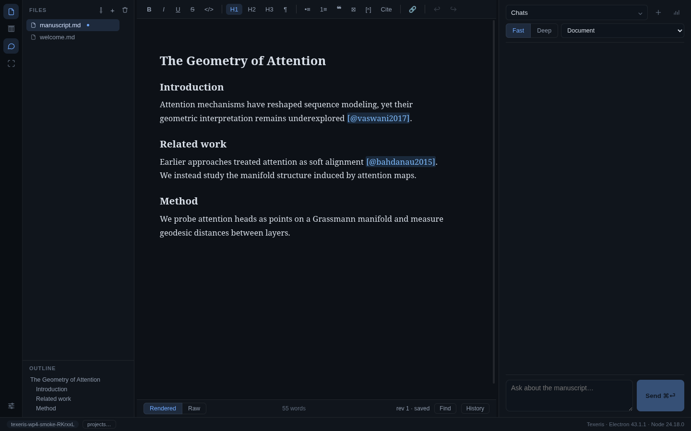
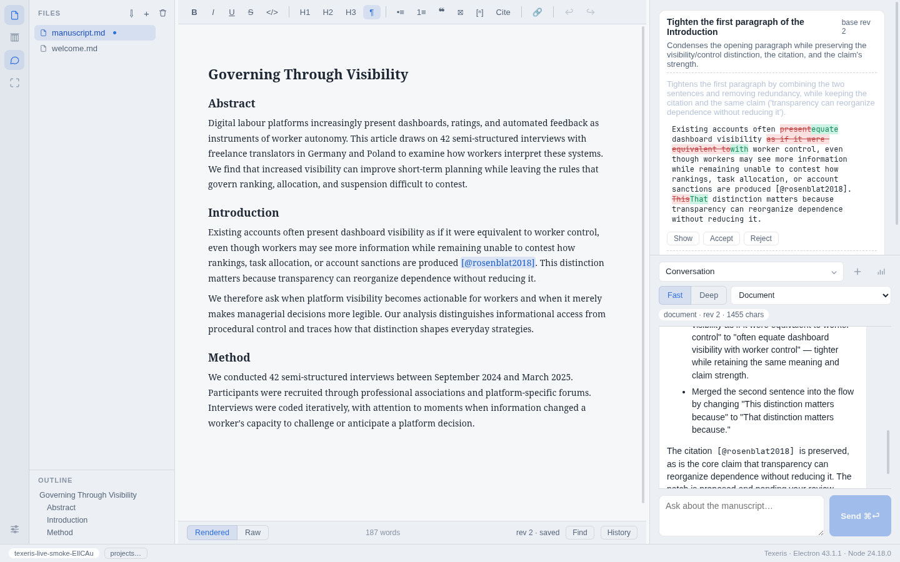

# Texeris

[](https://github.com/bair82/texeris/actions/workflows/ci.yml)

Texeris is a local-first desktop workspace for academic writing with
revision-aware AI editing. It combines a rendered Markdown editor, raw source
mode, project history, citations, a searchable writing archive, and an embedded
agent that can discuss a manuscript or propose reviewable changes.

The central constraint is simple: **the AI never edits the manuscript
directly**. It receives an explicit context scope and proposes a structured
patch against a known document revision. The writer can inspect the diff,
accept or reject individual groups, and undo accepted changes through the
revision history.

Texeris is functional and used as a working application, but it is still a
pre-release personal project rather than a polished public release.

## Screenshots

### Writing workspace



### Reviewable AI revision



The second screenshot uses a live DeepSeek response against an example
manuscript. The deterministic offline provider exercises the same UI and patch
pipeline without API keys.

## What works

- Rendered editing with Tiptap and raw editing with CodeMirror 6 over one
  canonical Pandoc-oriented Markdown document.
- Multiple projects and documents, autosave, revision history, checkpoints,
  document restore, find/replace, outline navigation, tables, footnotes, and
  images.
- Fast and Deep model modes with selection, section, or whole-document context
  and a visible context manifest.
- Persistent conversations, cancellation, usage records, safe conversation
  branching, message editing, and response regeneration.
- Structured AI patch review with per-group acceptance, conflict detection,
  provenance, and undo.
- Bounded writing skills for conservative rewriting and audit-first detection
  of formulaic verbal patterns.
- Project-owned CSL JSON references, BibTeX/RIS/CSL import, citation search and
  insertion, DOI metadata lookup, unresolved-key audit, and citeproc export.
- A local writing archive with immutable snapshots, provenance, FTS5 passage
  search, preview, explicit chat attachments, deletion, and index rebuilding.
- Markdown, DOCX, ODT, RTF, and text-bearing PDF import; Markdown, office, and
  fixed-layout PDF export through a pinned Pandoc build.
- Linux AppImage packaging and unsigned macOS DMG/ZIP packaging for Apple
  Silicon and Intel.

## Revision loop

```text
write or select text
        ↓
choose the context scope
        ↓
discuss or request a revision
        ↓
AI proposes a patch against base revision N
        ↓
review → accept/reject groups → revision N+1
```

Discussion, model access, and document mutation remain separate operations.
This boundary makes conflicts visible and keeps the canonical file recoverable
without model state or derived indexes.

## Architecture

Texeris is an Electron application written in strict TypeScript.

- The sandboxed React renderer owns presentation only.
- The Electron main process owns files, SQLite, credentials, project lifecycle,
  and validated IPC handlers.
- Tiptap and CodeMirror are two sessions over the same canonical Markdown text;
  both submit grouped text splices through IPC.
- SQLite uses Node's built-in `node:sqlite`; there are no native database
  modules.
- Pandoc conversion, PDF extraction, and print preparation run in cancellable
  worker threads with progress events.
- The embedded agent uses
  [`@earendil-works/pi-agent-core`](https://github.com/earendil-works/pi) behind
  an application adapter. It receives typed domain tools, never raw filesystem
  or shell access.
- Credentials are encrypted through Electron `safeStorage`. Manuscripts,
  revisions, references, and archive snapshots remain local unless the user
  explicitly invokes a model or online metadata lookup.

The main safety boundary is enforced in application code rather than delegated
to the model: every proposed prose change names a document, base revision,
expected text, and replacement.

## Run locally

Requirements: Node.js 22.19 or newer and pnpm 11.

```sh
pnpm install
TEXERIS_FAUX_PROVIDER=1 pnpm --filter @texeris/app dev
```

The faux provider is an in-process scripted model for offline development and
demonstration. It requires no credentials and exercises the complete
renderer/preload/main/agent path. Real DeepSeek and Moonshot AI credentials can
be configured in the application settings; environment variables are also
supported for development.

## Verification

```sh
pnpm --filter @texeris/app typecheck
pnpm --filter @texeris/app test
pnpm --filter @texeris/app build
pnpm --filter @texeris/app smoke
pnpm --filter @texeris/app dist:linux
```

The current local baseline is 267 passing Vitest tests with 6 conditional tests
skipped, plus offline Electron smoke coverage for editing, persistence, patch
review, citations, archive search, import/export, settings, project lifecycle,
and recovery. GitHub Actions typechecks, tests, builds, packages the Linux
AppImage, and inspects its bundled resources.

## Project status

The core writing and revision loop is coherent and functional. The largest
remaining work is release polish and several deeper academic workflows:

- reference-detail editing and broader citation fixtures;
- an application-level spellchecker for rendered and raw modes;
- PDF viewing, page-linked research, and OCR;
- searchable in-app help and an accessibility pass;
- application identity, licence/third-party notices, versioning, signing, and
  macOS notarisation.

See the [development plan](docs/development-plan.md) for the audited baseline,
delivery gates, and deliberately deferred features.

## Repository layout

- `app/` — the production Electron + React application.
- `docs/` — living product, architecture, and development documents.
- `spikes/` — disposable Milestone 0 prototypes retained as decision history.

Key documents:

- [Product specification](docs/product-spec.md)
- [Architecture options](docs/architecture-options.md)
- [Development plan](docs/development-plan.md)
- [Pi integration notes](docs/pi-integration-notes.md)
